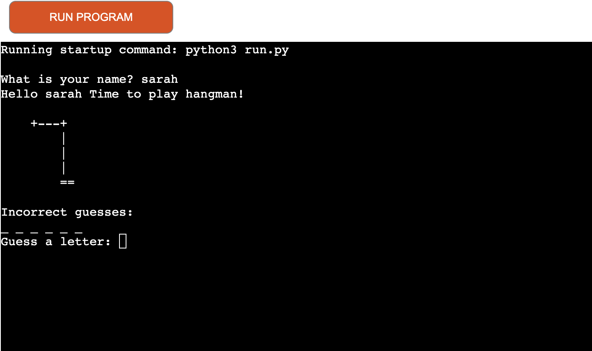
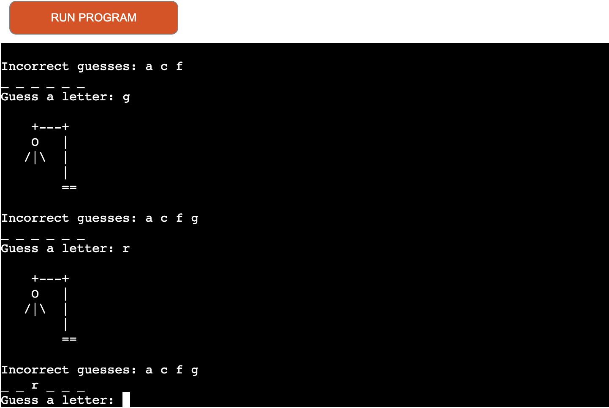
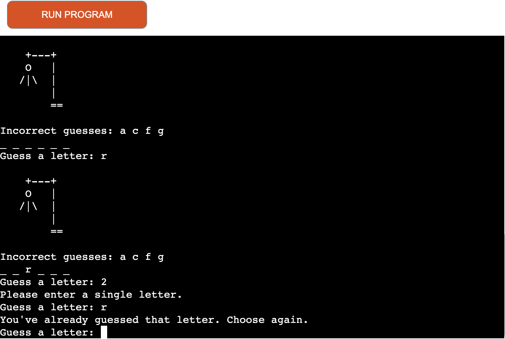
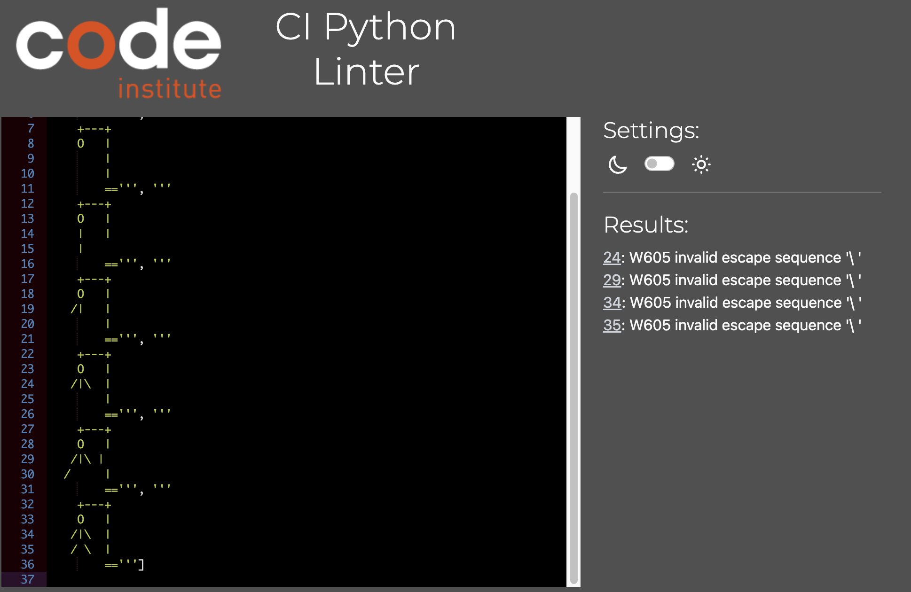

# Hangman-PY

Hangman Py is a Python terminal game that utilizes Code Institute mock terminal on Heroku.

Users can compete against the hangman and try to guess the correct word before it's to late!.

[Visit the live site](https://hangman-py-ci.herokuapp.com/)

## How to play

Hangman Py is based on the classic game of Hangman. The user is first prompted to enter their name. When the user inputs their name, the game will begin. The user will be presented with a blank line for each letter in the word.

The user will then be prompted to enter a letter. If the letter is in the word, the letter will be displayed in the correct position. If the letter is not in the word, the letter will be displayed in the incorrect letters section and the hangman will be drawn one step closer to being hanged.

---
## Features

### Existing Features

- The user can enter their name and the game will begin.
  - A image of the hangman will be displayed along with the number of incorrect guesses remaining based on the size of the random word.

- The user can enter a letter to guess the word.
  - If the letter is in the word, the letter will be displayed in the correct position.
  - If the letter is not in the word, the letter will be displayed in the incorrect letters section and the hangman will be drawn one step closer to being hanged.
  

- Input validation is in place to ensure that the user enters a single letter.
  - If the user enters a letter that has already been entered, they will be prompted to enter a different letter.
  - If the user enters more than one letter, they will be prompted to enter a single letter.
  - If the user enters a number or special character, they will be prompted to enter a single letter.

### Future Features

- Add a leader board to display the top 10 scores with google sheets.
- Add difficulty levels to the game, easy, medium hard.
- Add a timer to the game to add an extra challenge.

---
## Testing

- I manually tested the game to ensure that the game logic was working correctly. I also tested the input validation to ensure that the user was only able to enter a single letter.

- Passed the code through the [PEP8 online validator](https://pep8ci.herokuapp.com/) to ensure that the code was PEP8 compliant. The hangman graphic failed.

---

## Deployment

### Local Deployment

Please note that this project requires Python 3.6 or higher to run locally.

- Steps to run the project locally.
  - Fork or clone the repository into directory.
  - Run the run.py file.

### Deployment to Heroku

- Steps to deploy the project to Heroku.
  - Fork or clone the repository.
  - Create a new app on Heroku.
  - Set the buildpacks to Python and NodeJS in that order.
  - Link the Heroku app to the GitHub repository.
  - Click on deploy.

## Technologies Used

- [Python](https://www.python.org/)
  - The project uses **Python** to create the game logic.

---

The deployment terminal is set to 80 columns by 24 rows. That means that each line of text needs to be 80 characters or less otherwise it will be wrapped onto a second line.

-----
Happy coding!